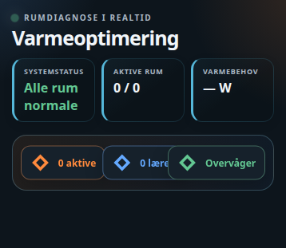

# HA Heating Diagnostics Card



> HACS installs both JavaScript files automatically. For a manual installation,
> copy `ha-heating-diagnostics-card.js` and `ha-card-list-editor.js` into the same folder.

A Home Assistant Lovelace card that turns per-room heating diagnostics into
an animated overview: valve-load gauge, a thermal-balance bar (learned heat
gain vs. calculated heat loss), a learning-model progress bar while a room's
baseline is still being established, and a deviation readout once it's
ready — plus flags for rooms that are cold under load or not responding to
a fully-open valve.

It's a generic "diagnostics" front end — every value comes from entities you
configure per room. It pairs well with anything that exposes room-level
valve position, heating output, heat-loss/utilisation figures and a learned
demand-status entity (it was built alongside
[Room Energy Optimizer](https://github.com/MRDonnii/ha-room-energy-optimizer),
but nothing in the card is specific to that integration).

Plain JavaScript, no build step — copy the file in and register it as a
dashboard resource.

> **Note:** the card's on-screen labels are currently Danish only. There's
> no built-in translation layer yet — fork the file and edit the label
> strings directly if you need another language.

## Installation

### HACS (custom repository)

1. In HACS, go to **Frontend** → the three-dot menu → **Custom repositories**.
2. Add `https://github.com/MRDonnii/ha-heating-diagnostics-card` as type
   **Dashboard**.
3. Install **HA Heating Diagnostics Card** and add the resource if HACS
   doesn't do it automatically.

### Manual

1. Download `ha-heating-diagnostics-card.js` from the latest release (or
   this repo).
2. Copy it to
   `config/www/community/ha-heating-diagnostics-card/ha-heating-diagnostics-card.js`.
3. Add it as a dashboard resource:
   ```yaml
   url: /local/community/ha-heating-diagnostics-card/ha-heating-diagnostics-card.js
   type: module
   ```

## Usage

Add the card via the dashboard editor (search for "Heating Diagnostics") or
in YAML:

```yaml
type: custom:ha-heating-diagnostics-card
title: Heating optimisation
learning_hours: 48
total_demand: sensor.house_heat_demand_w
data_problem: binary_sensor.heating_data_problem
rooms:
  - name: Living room
    icon: mdi:sofa
    climate: climate.living_room
    demand_status: sensor.living_room_heat_demand_status
    valve: sensor.living_room_valve_position
    output: sensor.living_room_heat_output
    utilisation: sensor.living_room_capacity_utilisation
    loss: sensor.living_room_heat_loss
    heating_power: sensor.living_room_heating_power
    stressed: binary_sensor.living_room_radiator_stressed
    hours: sensor.living_room_radiator_hours_this_month
    cost: sensor.living_room_heating_cost_today
    share: sensor.living_room_heat_share
    rated: sensor.living_room_rated_power
    area: sensor.living_room_area
```

Only `name` is required per room; every other field is optional and simply
shown as "—" or omitted from calculations when missing. A room missing
`climate`, `valve`, `output`, `utilisation` or `loss` is flagged with a
"Manglende data" diagnosis instead of guessing.

## Configuration reference

| Key | Description |
|---|---|
| `title` | Card header text |
| `learning_hours` | Hours of data a room's baseline model needs before it's considered ready (default `48`) |
| `total_demand` | Sensor (W) — total house heat demand, shown in the header |
| `data_problem` | `binary_sensor` — when `on`, the whole card reports a data problem |
| `animation` | Toggle CSS animations (default `true`) |
| `rooms` | List of room objects, see below |

### Room object

| Key | Description |
|---|---|
| `name` | Room label (required) |
| `icon` | MDI icon (default `mdi:radiator`) |
| `climate` | `climate` entity — current/target temperature, and the more-info shortcut |
| `demand_status` | Sensor whose state is `learning` / `normal` / `deviating`, with `baseline_learning_hours`, `baseline_ready` and `deviation_percent` attributes |
| `valve` | Sensor (%) — valve/radiator position, drives the gauge |
| `output` | Sensor (W) — current heat output |
| `utilisation` | Sensor (%) — capacity utilisation |
| `loss` | Sensor (K/min) — calculated heat loss, used for the thermal-balance bar |
| `heating_power` | Sensor (K/min) — learned heating power, used for the thermal-balance bar |
| `stressed` | `binary_sensor` — flags a radiator that's pressed/overloaded |
| `hours` | Sensor — radiator run-hours this month |
| `cost` | Sensor — estimated heating cost |
| `share` | Sensor (%) — this room's share of total heat demand |
| `rated` | Sensor (W) — rated radiator power |
| `area` | Sensor (m²) — room area |

Clicking a room card (or its **Se diagnosedata** button) opens the
`demand_status` entity's more-info dialog, falling back to `climate`.

## License

MIT — see [LICENSE](LICENSE).
The visual card editor provides entity pickers and add/remove controls for rooms
and diagnostic sensors.
